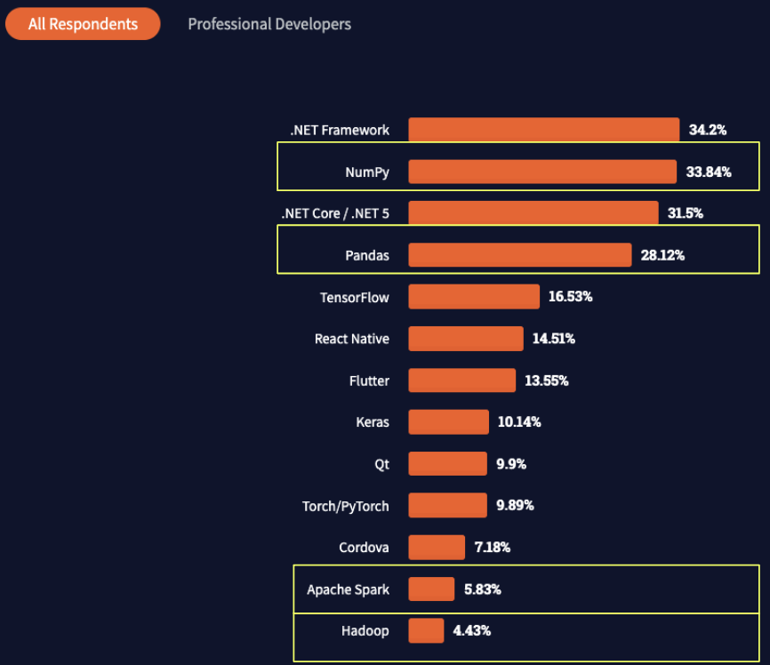

[Fugue](https://github.com/fugue-project/fugue/), an open-source abstraction layer for distributed computing, makes big data projects cheaper by increasing developer productivity and reducing hardware costs. Fugue does this by porting Python and Pandas code to either Spark or Dask for users. This makes the transition from local computing to distributed computing seamless.

From the recent [StackOverflow survey](https://insights.stackoverflow.com/survey/2021#section-most-popular-technologies-other-frameworks-and-libraries), the adoption rate of small data tools such as NumPy and Pandas is 7x more compared with big data tools like Spark and Hadoop. Despite all the buzz around big data, it's clear that adoption has not caught up.



But this is understandable because of the following:

1. It is hard for companies to get developers that have hands-on experience with Spark.
2. Even with big data developers, projects are hard to execute, often becoming overly expensive and long to complete.
3. Even if a big data project is completed, it takes specialized knowledge to maintain.
4. It is not straightforward to obtain compute resources for big data

Among these four reasons, Fugue solves the first three by allowing developers who already know Pandas, Python or SQL to leverage distributed computing engines such as Spark and Dask. Fugue democratizes distributed computing by decoupling logic and execution. Users can define business logic in their preferred grammar. When ready to run on the full big dataset, the execution engine can be specified and Fugue will handle porting the code. For example, the most used function of Fugue is the `transform` function, which handles bringing one function to the distributed setting.

In the example below, we have a column called `value`, and we want to create a new column based on the letter in that column. To do this, we create the `map_letter_to_food` function that uses Pandas to perform the operation.

```python
import pandas as pd
from typing import Dict

input_df = pd.DataFrame({"id":[0,1,2], "value": (["A", "B", "C"])})
map_dict = {"A": "Apple", "B": "Banana", "C": "Carrot"}

def map_letter_to_food(df: pd.DataFrame, mapping: Dict[str, str]) -> pd.DataFrame:
    df["value"] = df["value"].map(mapping)
    return df
```

To bring this to Spark, all we have to do is specify `"spark"` as the engine as seen below. The engine can also take in a `SparkSession`. If the engine is left empty, it will run on the native Pandas engine.

```python
from fugue import transform
import fugue_spark

df = transform(input_df,
               map_letter_to_food,
               schema="*",
               params=dict(mapping=map_dict),
               engine="spark"
            )
```

This allows users to test the function on smaller data, and bring it to Spark without any re-writes. Functions are now reusable across small data and big data projects. Fugue also reduces lock-in to a specific framework. Currently, it is very common for engineers to scale vertically (making the underlying machine more powerful) in order to execute Pandas code on big data. Often though, only one step in a bigger pipeline needs more resources. Thus, scaling vertically is signifcantly more expensive and less efficient than using the Spark or Dask engines which both utilize all available cores across a cluster of machines that can be auto-scaled for more intensive operations. This gives the following benefits:

1. Unit tests can be run without using Spark or Dask, which have a higher overhead than testing on Pandas.
2. Instead of developing across a cluster, code can be iterated on using a local machine.
3. Future maintenance is devoid from boilerplate code that comes from big data frameworks.
4. The same business logic can be applied to both big and small data projects.
5. There is no lock-in to one big data framework and it's easy to change in the future as long as Fugue supports it as a backend. For example, if Ray becomes the dominant framework, Fugue just needs to add a RayExecutionEngine.

Even for current Spark users, it is easy to fall into pitfalls of distributed compute that make programs inefficient or unstable. For example, users coming from a Pandas mindset are not used to `persisting` dataframes that will be used repeatedly. Without persisting in Spark or Dask, it's very easy to repeat the computation of that DataFrame. Fugue solves this by using it's own Directed Acyclic Graph (DAG) to auto-persist dataframes that will be used again.

From [Lyft's blog](https://eng.lyft.com/how-lyftlearn-democratizes-distributed-compute-through-kubernetes-spark-and-fugue-c0875b97c3d9) on Fugue adoption, they saw the following metrics:

* The execution time of Spark jobs dropped from 3 hours to 0.3 hours
* Total usage of Spark increased by over 60%
* The total cost of Spark execution dropped by over 50% in the same time frame

But why does Fugue reduce job time if it just ports code to Spark? This is because Fugue provides guard rails that enforce best practices (like auto-persist mentioned above) so that the transition to big data is as effective as possible. For example, Dask does not require schema to be defined, but defining it removes the need for computationally expensive inference so it was made to requiree on the Fugue level.

Also, developers can prototype more locally, before bringing code to Spark. This means that the code executing on Spark is already more production ready and expensive mistakes are avoided. Currently, PySpark code becomes fragile in production because it's very hard to adhere to best practices when it comes to testing. For example, the equivalent PySpark code of the transform function can be seen below. No need to fully understand the code, the point is about how much code is introduced.

```python
from typing import Iterator, Union
from pyspark.sql.types import StructType
from pyspark.sql import DataFrame, SparkSession

spark_session = SparkSession.builder.getOrCreate()

def mapping_wrapper(dfs: Iterator[pd.DataFrame], mapping):
  for df in dfs:
      yield map_letter_to_food(df, mapping)

def run_map_letter_to_food(input_df: Union[DataFrame, pd.DataFrame], mapping):
  # conversion
  if isinstance(input_df, pd.DataFrame):
      sdf = spark_session.createDataFrame(input_df.copy())
  else:
      sdf = input_df.copy()

  schema = StructType(list(sdf.schema.fields))
  return sdf.mapInPandas(lambda dfs: mapping_wrapper(dfs, mapping),
                          schema=schema)

result = run_map_letter_to_food(input_df, map_dict)
```

This adds two more functions that then need to be tested, and significantly more boilerplate code that has to be maintained. Note that this is just one version of the `transform` function. The `transform` function can handle more data types beyond Pandas DataFrames. For example, it can operate with functions that have input types like `List[Dict[str,Any]]` or `List[List[Any]]` or even `Iterable[Dict[str, Any]]`. For each of these input types, the equivalent PySpark code will change because we can't use `mapInPandas` anymore. For Fugue's `transform` function, nothing has to change. More information can be found [here](https://fugue-tutorials.readthedocs.io/tutorials/beginner/type_flexibility.html).

Fugue believes that code should adapt to users. The currently available data frameworks have strong lock-in and it becomes hard to change. Looking at the `transform` example above, Fugue adds very minimal boilerplate code. Because the `transform` function is already heavily tested on a Fugue level, users don't need to add significaly more unit tests. By making distrubuted frameworks easier to use, Fugue makes big data projects small and accessible for all data professionals.